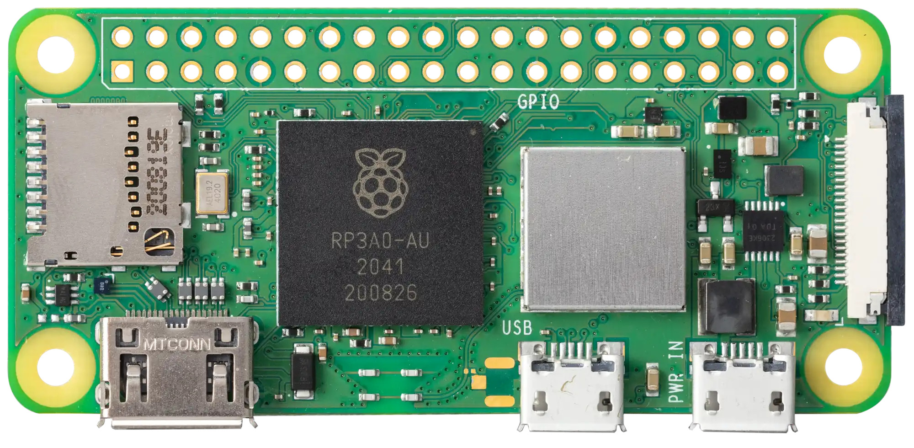
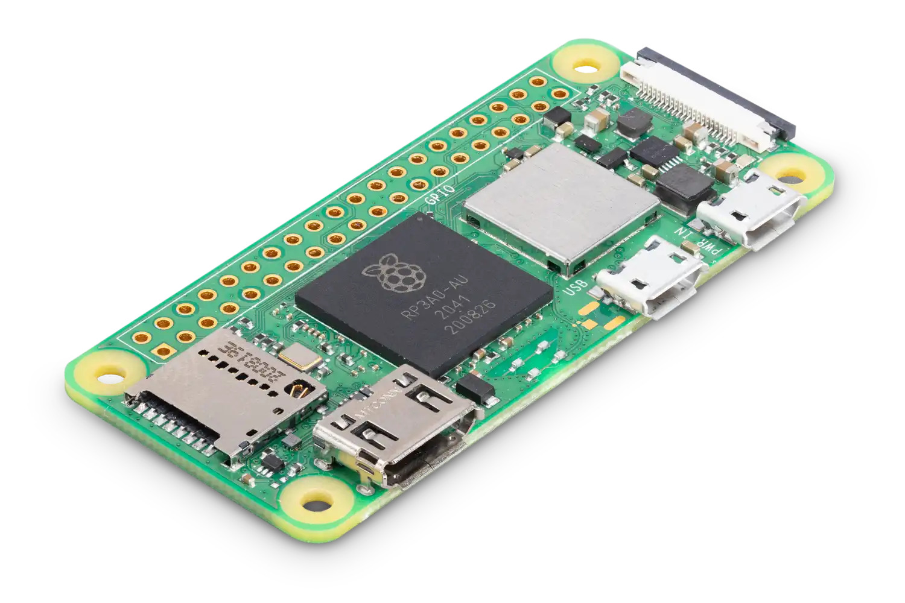

# 🎓 Smart Attendance System using Face Recognition

> An AI-powered Smart Attendance System developed using **Raspberry Pi zero 2 w **, **FastAPI**, **OpenCV**, and **InsightFace** to automate classroom attendance through real-time face recognition.

---

## 📖 Project Overview

The **Smart Attendance System** is a real-time attendance solution developed as part of our **Diploma Minor Project**.

Traditional classroom attendance consumes valuable lecture time and requires continuous manual effort. To address this challenge, our team designed an intelligent attendance system that automatically recognizes students using face recognition technology and records attendance without manual intervention.

The system follows a distributed architecture where a **Raspberry Pi** captures live camera frames, a **FastAPI backend** performs face recognition using the **InsightFace AI model**, and the attendance is displayed on both a **web dashboard** and a **16×2 LCD display**.

---

# 📸 Hardware Components

> Place the images below in your repository (for example in an `assets/` folder) and update the paths if needed.

| Raspberry Pi Zero 2 W | Raspberry Pi Zero 2 W (Angle View) |
|:---------------------:|:----------------------------------:|
|  |  |

### 16×2 LCD Display

<p align="center">
  
</p>

---

# 🎯 Problem Statement

In most educational institutions, attendance is still recorded manually.

- ⏱️ Takes 5–10 minutes every lecture
- 📚 Interrupts teaching
- ✍️ Requires manual effort
- ❌ Prone to human error
- 📋 Difficult to maintain at scale

Our goal was to automate attendance using AI-powered face recognition.

---

# 💡 Proposed Solution

The Raspberry Pi captures live images through a webcam and sends them to a FastAPI backend over the local network. The backend performs face detection and recognition using InsightFace, records attendance, and updates both the web dashboard and LCD display in real time.

---

# ✨ Features

- 🎯 Real-time Face Recognition
- 📷 USB Webcam Integration
- 🍓 Raspberry Pi Zero 2 W Client
- ⚡ FastAPI Backend
- 🧠 InsightFace AI Model
- 🖥️ Live Attendance Dashboard
- 📟 16×2 LCD Status Display
- 📝 Automatic Attendance Logging
- 🚫 Duplicate Attendance Prevention
- 🌐 Local Network Communication

---

# 🏗️ System Architecture

```text
                    Webcam
                       │
                       ▼
             Raspberry Pi Client
                       │
          HTTP Image Upload Request
                       │
                       ▼
          FastAPI Backend (MacBook)
                       │
              Face Recognition
             (InsightFace Model)
                       │
        ┌──────────────┴──────────────┐
        ▼                             ▼
 attendance.csv              Attendance Dashboard
        │
        ▼
 16×2 LCD Display
```

---

# ⚙️ Technology Stack

| Technology | Purpose |
|------------|---------|
| Python | Core Programming Language |
| FastAPI | Backend API Framework |
| Uvicorn | ASGI Server |
| OpenCV | Image Processing |
| InsightFace | Face Detection & Recognition |
| NumPy | Numerical Computation |
| Raspberry Pi Zero 2 W | Client Device |
| HTML/CSS/JavaScript | Dashboard |
| CSV | Attendance Storage |

---

# 📂 Suggested Project Structure

```text
smart-attendance-system/
│
├── backend/
│   ├── main.py
│   └── known_faces/
├── raspberry-pi/
│   └── live_client.py
├── frontend/
│   └── attendance.html
├── assets/
│   ├── zero2-close-up.jpg
│   ├── zero2-hero.jpg
│   └── lcd-display.jpeg
├── screenshots/
├── docs/
├── requirements.txt
├── LICENSE
└── README.md
```

---

# 🔄 Workflow

1. Webcam captures a frame.
2. Raspberry Pi sends the image to the FastAPI backend.
3. InsightFace detects and recognizes the face.
4. Attendance is stored in `attendance.csv`.
5. LCD displays the student's name.
6. Dashboard updates attendance in real time.

---

# 🚧 Challenges Faced

- Dynamic IP changes across Wi-Fi networks
- LCD flickering
- Duplicate attendance prevention
- Face recognition confidence tuning
- Backend and Raspberry Pi communication
- CORS configuration for dashboard

---

# 🚀 Future Improvements

- Database (MySQL/PostgreSQL)
- Docker deployment
- Cloud hosting
- Face registration portal
- Admin authentication
- Multi-camera support
- Analytics dashboard
- Mobile application

---

# 👥 Team

This project was developed as part of our **Diploma Minor Project**.

| Team Member | Contribution |
|-------------|--------------|
| Suyash | Backend, Face Recognition, Raspberry Pi Integration, Networking |
| Member 2 | Hardware & Testing |
| Member 3 | Frontend |
| Member 4 | Documentation |
| Member 5 | Testing & Validation |

> Update the names and contributions before publishing.

---

# 📄 License

This project is licensed under the **MIT License**.

---

⭐ If you like this project, consider giving it a star!
